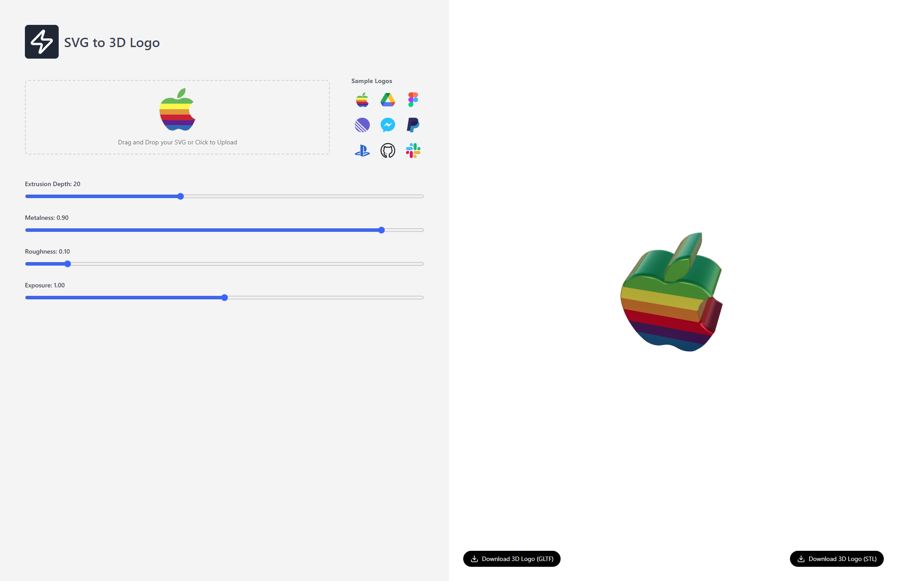
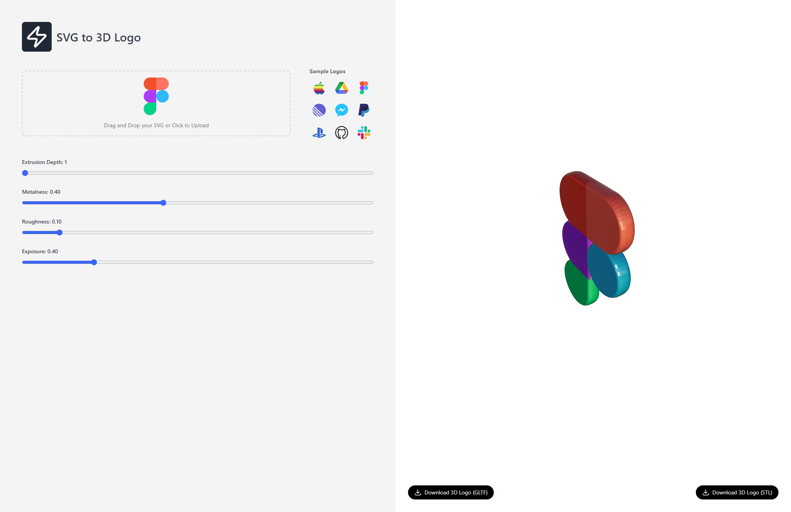

# SVG to 3D

While going through my twitter feed I came across a project that allowed users to upload SVG files, extrude them into 3D models using Three.js, and charged $5 for downloading the resulting GLTF file. Given the simplicity of the project, I felt it should be free and open-source since all the heavy lifting is being done by Three.js. 

This project is built with Next.js and Tailwind CSS. The generated 3D models can be downloaded in GLTF or STL format. SVGs are converted to 3d using Three.js by extruding them.

## Demo

[https://svg-to-3d-demo.vercel.app/](https://svg-to-3d-demo.vercel.app).

## Screenshots




## Getting Started

### Installation

1. Clone the repository:

   ```bash
   git clone https://github.com/its-arun/svg-to-3d.git
   cd svg-to-3d
   ```

2. Install the dependencies:

   ```bash
   npm install
   ```

3. Run the development server:

   ```bash
   npm run dev
   ```

4. Open [http://localhost:3000](http://localhost:3000) in your browser to see the application in action.

## Usage

1. Upload an SVG file using the file input on the homepage.
2. The application will automatically convert the SVG to a 3D model and display it in the canvas.
3. Interact with the 3d model using your mouse or touch gestures.
4. Download the 3d model in GLTF or STL format.

## Technologies Used

- [Next.js](https://nextjs.org/)
- [Tailwind CSS](https://tailwindcss.com/)
- [Three.js](https://threejs.org/)

## Contributing

Contributions are welcome! Please feel free to submit a Pull Request.
